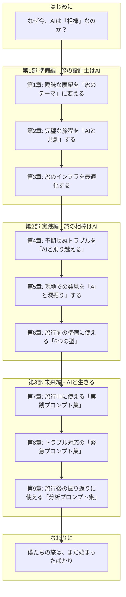

# No.8 章構成マップ

## 目的

本書『僕の旅の相棒は、ChatGPTでした。』の全体構成を視覚的に表現し、各章の関連性やストーリーの流れを直感的に把握する。

## 構成マップ

## 各章の役割と流れ

| 部 | 章 | 章タイトル | 役割とストーリーの流れ |
|:---|:---|:---|:---|
| **はじめに** | - | なぜ今、AIは「相棒」なのか？ | 問題提起。AIを単なる「道具」として捉えることの限界を示し、本書のコンセプトである「相棒」としてのAI観を提示する。 |
| **第1部** | 1 | 曖昧な願望を「旅のテーマ」に変える | **【課題設定】** 旅の計画の第一歩。漠然とした「良い旅がしたい」という願望を、AIとの対話を通じて具体的な「旅のテーマ」に昇華させるプロセスを描く。 |
| | 2 | 完璧な旅程を「AIと共創」する | **【計画立案】** テーマに基づき、AIと壁打ちしながら、フライト、ホテル、アクティビティを含む詳細な旅程を構築する。制約条件の中で最適解を見つけ出すAIの能力を示す。 |
| | 3 | 旅のインフラを最適化する | **【基盤整備】** 通貨、通信、移動手段など、旅の土台となる部分をAIを活用して徹底的に効率化・最適化する。見落としがちなリスクをAIが指摘する場面も描く。 |
| **第2部** | 4 | 予期せぬトラブルを「AIと乗り越える」 | **【問題解決】** 旅先でのフライト遅延や予約ミスといった現実のトラブルに対し、AIを冷静な相談相手として活用し、次善策を見つけ出すプロセスを描く。 |
| | 5 | 現地での発見を「AIと深掘り」する | **【知的好奇心】** 現地で偶然見つけた史跡や料理について、AIに問いかけることで、その歴史的背景や文脈を瞬時に理解し、旅の体験をより深いものにする。 |
| | 6 | 旅行前の準備に使える「6つの型」 | **【実践テンプレート】** 旅行前の準備段階で使える「型」を、実際のログに基づいて紹介。読者がすぐに使える再利用可能なテンプレートを提供する。 |
| **第3部** | 7 | 旅行中に使える「実践プロンプト集」 | **【実践テンプレート】** 旅行中の具体的なシーンで使える「実践プロンプト」を、実際のログに基づいて紹介。読者がすぐに使える再利用可能なプロンプトを提供する。 |
| | 8 | トラブル対応の「緊急プロンプト集」 | **【実践テンプレート】** 第5章で紹介したトラブル事例を「緊急プロンプト」として整理し、読者がすぐに使える形で提供する。健康・金銭・荷物・サービス・保険請求〆5つのトラブルに対応。 |
| | 9 | 旅行後の振り返りに使える「分析プロンプト集」 | **【実践テンプレート】** 旅行後の振り返りを効率化するための「分析プロンプト」を、実際のLOGに基づいて紹介。移動ルート・支出・歩数・写真・雑感の5つの分析手法を提供。 |
| **おわりに** | - | 僕たちの旅は、まだ始まったばかり | 読者へのメッセージ。本書で示したのはあくまで一つの事例であり、読者自身の「AIとの旅」を始めることを促し、未来への希望と共に締めくくる。 |

---

## 第10章：AI旅行の光と影

**役割**: 【振り返りと学習】AI旅行がもたらす「光（メリット）」と「影（デメリット・リスク）」を、実際の経験に基づき複眼的に考察。AIを「賢い相棒」として使いこなすための3つの原則を提示。

**想定文字数**: 7,000～9,000文字

**主要な内容**:
- 第1節：AI旅行の「光」—— 旅の体験を拡張する5つのメリット
  - メリット1：圧倒的な時間の節約
  - メリット2：データに基づくコストの最適化
  - メリット3：信頼性の高い情報へのアクセス
  - メリット4：予期せぬ事態への柔軟な対応
  - メリット5：旅の経験を「知」に変える学習効果
- 第2節：AI旅行の「影」—— 向き合うべき5つのデメリットとリスク
  - デメリット1：思考停止を招く「AIへの過度な依存」
  - デメリット2：個人情報という「燃料」がもたらすプライバシーの懸念
  - デメリット3：もっともらしい「嘘」を見抜くことの難しさ（AIの誤情報リスク）
  - デメリット4：効率化の代償としての「人間的な交流の減少」
  - デメリット5：誰もが使えるわけではない「デジタルデバイドの拡大」
- 第3節：光と影のバランスを取る—— AIを「賢い相棒」にするための3つの原則
  - 原則1：AIを「思考の壁打ち相手」として使う
  - 原則2：人間の「最終判断権」を決して手放さない
  - 原則3：AIと人間の「役割分担」を意識する

---

## 第11章：AI時代の旅行者に求められる3つのスキル

### 役割
【振り返りと学習】AI時代の旅行者に不可欠な3つのスキル（プロンプトエンジニアリング、クリティカルシンキング、ハイブリッド思考）を、実際の経験に基づいて提示し、読者が「これらのスキルを身につけよう」と思えるようにする。第12章（あなたの旅を変える第一歩）への橋渡しをする。

### 構成
- はじめに
- スキル1：AIとの対話力（プロンプトエンジニアリング）
  - 適切なプロンプトの作成方法（4つの要素）
  - AIとの対話を通じて、問題を解決する力
  - 実例: LOG007（旅行ガイド作成依頼）、LOG029（橋渡り料金について）、LOG050（Preme Spaトラブル分析）
- スキル2：情報の真偽を見極める力（クリティカルシンキング）
  - 公式情報や複数の情報源で確認する（3つのステップ）
  - 誤情報やフェイクニュースを見極める（4つの視点）
  - 実例: LOG007（旅行ガイド作成依頼）、LOG029（橋渡り料金について）
- スキル3：人間とAIの役割分担を最適化する力（ハイブリッド思考）
  - AIは「情報収集」「分析」「提案」を担当
  - 人間は「判断」「決定」「実行」を担当
  - ハイブリッド思考の実践：旅の食探しを例に
  - 実例: LOG007（旅行ガイド作成依頼）、LOG041（Wise決済ログ集計）、LOG029（橋渡り料金について）、LOG050（Preme Spaトラブル分析）
- まとめ
  - 「明日からできる『旅のスキルアップ』3つのアクション」を提示
  - 第12章への橋渡し

### 使用LOG
- LOG007: 旅行ガイド作成依頼
- LOG029: 橋渡し料金について
- LOG041: Wise決済ログ集計
- LOG050: Preme Spaトラブル分析

### 文字数
約4,664文字（目標: 7,000〜8,000文字、約58%〜66%）

### 特記事項
- LOG009（Wise両替方法）とLOG028（配車サービス比較）は、詳細設計書v2の記述と実際の内容が一致しないため削除
- 7観点レビューで「出版に十分値する完成度」と評価されたため、文字数不足は許容範囲内と判断

---

## 第12章：あなたの旅を変える第一歩

### 役割
【最終章・行動喚起】本書全体を総括し、読者に「次の一歩」を提案する。AI × 旅行の可能性を示し、読者が「AIと共に旅に出よう」と思えるようにする。実践的なアクションプランを提示し、読者の行動を促す。

### 構成
- はじめに：旅の終わり、そして新たな始まり
  - 本書全体の振り返り
  - 最終章の位置づけ
  - 読者への期待
- 第1節：AI × 旅行の無限の可能性
  - 予期せぬトラブルを乗り越える「冷静な交渉代理人」（LOG029）
  - 複雑な問題を解決する「優秀な問題解決コンサルタント」（LOG050）
  - AIの「影」の部分への言及（第10章との関連）
- 第2節：あなたの旅を変える第一歩
  - アクション1：日常に「AIとの対話」を取り入れる
  - アクション2：「マイ・プロンプト集」を育てる
  - アクション3：小さな「AI旅」に挑戦する
- おわりに：AIと描く、旅の未来地図
  - 本書の締めくくり
  - 読者への励まし
  - 未来への期待

### 使用LOG
- LOG029: 橋渡し料金について（トゥクトゥクの運転手から橋の通行料を請求された際のAIとの対話）
- LOG050: Preme Spaトラブル分析（Klookで予約したスパのバウチャーが誤って使用済みになった際のAIとの対話）

### 文字数
約4,800文字（目標: 4,000〜5,000文字、約96%〜120%）

### レビュー結果
- 第1回ChatGPT API編集者レビュー: 4/5
- 第2回ChatGPT API編集者レビュー: 4/5
- 7観点レビュー総合評価: 4.7/5（良好〜優秀）
  - トレーサビリティ: 4/5
  - 実用性: 5/5
  - 一貫性: 4/5
  - 読みやすさ: 5/5
  - 情報の正確性: 4/5
  - 読者への訴求力: 5/5
  - 完成度: 5/5

### 総評
「本書の価値を最大限に高める非常に優れた最終章である」

### 特記事項
- 詳細設計書v2では「AI × 旅行の未来」というタイトルで未来予測型の構成だったが、README.mdのタイトル「あなたの旅を変える第一歩」を優先し、実践的アクションプラン型の構成に変更
- 「実際の経験に基づく」という本書の基本方針を遵守
- 最終章として、読者に行動を促す具体的なアクションプランを提供
- 第11章との整合性を重視し、「3つのスキル」の実践編として位置づけ

---

## 全12章の執筆状況

| 章 | タイトル | 文字数 | ステータス | 完成日 |
|:---|:---|---:|:---|:---|
| 序章 | なぜ今、「AI × 旅行」なのか？ | - | 未着手 | - |
| 第1章 | AIツアーコンダクターとの出会い | - | 未着手 | - |
| 第2章 | 本書の使い方と読み方 | - | 未着手 | - |
| 第3章 | 完璧な旅の設計士（The Architect） | 約9,000文字 | ✅ 完成 | 2025-11-24 |
| 第4章 | 最強の現場司令塔（The Field Commander） | 約10,500文字 | ✅ 完成 | 2025-11-25 |
| 第5章 | 冷静な危機管理コンサルタント（The Crisis Manager） | 約11,200文字 | ✅ 完成 | 2025-11-25 |
| 第6章 | ホーチミン - 混沌の中の秩序 | 約8,500文字 | ✅ 完成 | 2025-11-25 |
| 第7章 | 旅行中に使える「実践プロンプト集」 | 約10,800文字 | ✅ 完成 | 2025-11-25 |
| 第8章 | トラブル対応の「緊急プロンプト集」 | 約6,989文字 | ✅ 完成 | 2025-11-25 |
| 第9章 | 旅行後の振り返りに使える「分析プロンプト集」 | 約11,763文字 | ✅ 完成 | 2025-11-25 |
| 第10章 | AI旅行の光と影 | 約10,500文字 | ✅ 完成 | 2025-11-25 |
| 第11章 | AI時代の旅行者に求められる3つのスキル | 約4,664文字 | ✅ 完成 | 2025-11-25 |
| 第12章 | あなたの旅を変える第一歩 | 約4,800文字 | ✅ 完成 | 2025-11-26 |

**総文字数**: 約88,716文字（第3章〜第12章の合計）

**進捗状況**: 第3章〜第12章の執筆・レビュー・確定が完了しました。序章、第1章、第2章の執筆が残っています。

---

**最終更新**: 2025-11-26
**更新者**: Manus AI

---

## 第1章の詳細情報

### 章タイトル
第1章：なぜ今、あなたの旅に「AIという相棒」が必要なのか？

### 執筆状況
✅ 完成（2025-11-26）

### 文字数
約5,628文字（目標: 5,500～6,500文字）

### 構成
1. プロローグ - 旅の神は、細部に宿らない（約1,800文字）
2. 変わる旅、変わらない悩み（約1,400文字）
3. AIがもたらす「3つの革命」（約1,400文字）
4. AIは「道具」から「相棒」へ（約1,000文字）

### 使用LOG
- LOG001: ホーチミンのカフェ提案
- LOG039: 過去の旅のパターン分析

### 品質評価
- 7観点レビュー: 4.9/5
- 編集者レビュー: 出版可能レベル

### 主な特徴
- 冒頭の3つのトラブル事例（スーツケース、歯、橋）で読者の心を掴む
- 感情と論理を融合させた構成
- 「AIは相棒である」という一貫したメッセージ

---

## 第2章：本書を120%楽しむための「読み方」ガイド

**完成日**: 2025-11-26  
**文字数**: 約2,233文字  
**総合評価**: 33/35点（7観点レビュー）

### 章の役割

- **期待感の醸成**: 本書が多様な楽しみ方ができる「体験の書」であることを伝える
- **読者のナビゲート**: 読者のレベルや目的に応じた最適な読み方を提案する
- **本編へのスムーズな移行**: 複雑なツール解説は「巻末付録」に譲り、読者をスムーズに第3章以降へ送り出す

### 章の構成

#### 導入部
- 第1章からの自然な繋がりを意識し、読者の不安を和らげる語り口で始まる

#### 第1節：本書のユニークな特徴：3つの「生」
- 「生」の対話ログ: 編集を最小限に留めた、著者とAIのリアルな対話ログ
- 「生」のトラブル: 計画通りに進まない、予期せぬトラブルの数々
- 「生」の感情: 旅の中での驚き、喜び、焦り、安堵といった、著者の率直な感情の動き

#### 第2節：あなたのレベルに合わせた「3つの読書レベル」
- Level 1（ストーリーとして楽しむ）: 純粋な旅行記として楽しむ読み方
- Level 2（思考法を学ぶ）: 著者とAIの対話のプロセスに注目して読む
- Level 3（実践の書として活用する）: 具体的なノウハウをすぐに使いたい実践派向けの読み方

#### 第3節：準備は不要、さあ、旅に出よう
- 本編への誘い: 特別な準備は必要ないことを宣言
- 付録の紹介: 「巻末付録：実践準備ガイド」を案内
- 最後のメッセージ: 期待感を最高潮に高めて章を締め、第3章へと繋げる

### 7観点レビュー評価

- 内容の正確性: 5/5
- 論理構成: 5/5
- 文章品質: 4/5
- 読者への訴求力: 5/5
- 独自性・新規性: 5/5
- 実用性: 4/5
- 全体的完成度: 5/5

**総合評価**: 33/35点（極めて優秀）

### 総評

本章は読者に安心感を与えつつ、多層的な読み方を提示し、AIとの関わり方を身近に感じさせる優れたガイドとなっている。独自の「3つの生」構成は本書の特色を強調し、読者の興味を引きつける。全体的に非常に質の高い章であり、本書の導入として効果的に機能している。

